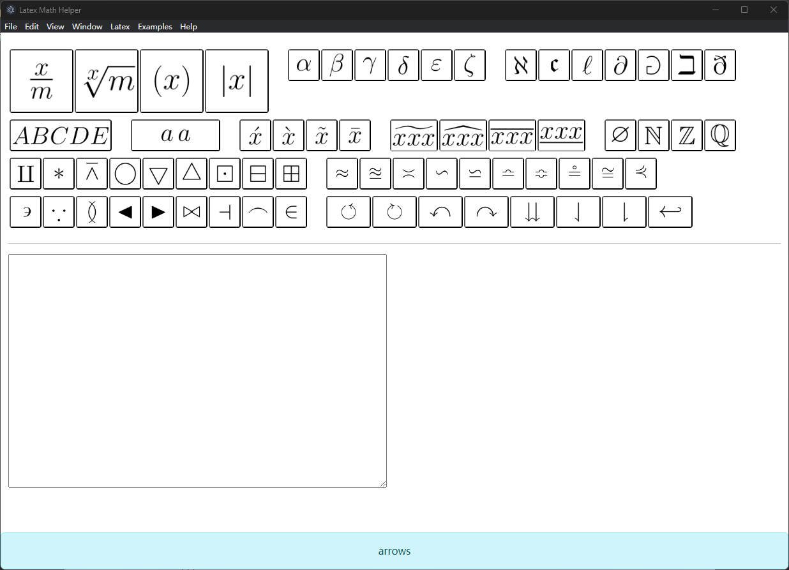

# LatexMathHelper
LatexMathHelper

## 截图

## 开发计划
pre版本1.0版本将参考资料3讨论的数学符号都实现便捷输入。

**后续各位有需求提issue来新增功能。**

## CHANGELOG
### 0.1.6
- 增加数学函数输入菜单
- 增加一些基本的符号
- 增加上下标记符号

### 0.1.5
- 增加数学集合符号
- 所有链接都跳转到系统的默认浏览器
- 初步菜单制作

### 0.1.4
增加鼠标右键复制到粘贴板功能

### 0.1.3
信息栏功能移动到下方更改为状态栏信息。

### 0.1.2
加入提示信息栏，提供对应的Unicode符号编码或者搜索关键词。

### 0.1.1
初步有个样子了，希腊字母和数学着重符号已加入。
